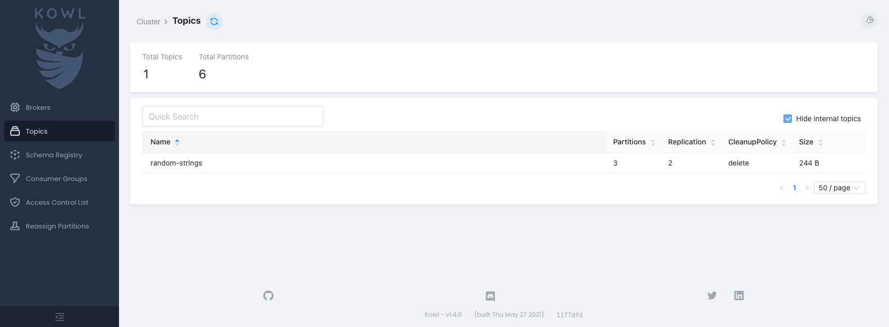
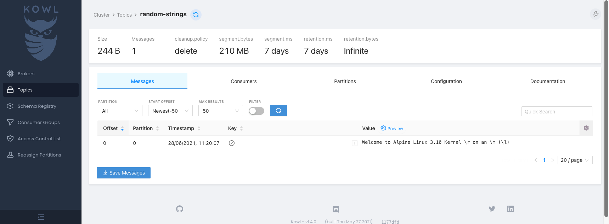

Aiven for Apache Kafka is an excellent option if you need to run Apache Kafka at scale - or even if you don’t. Get up and running with a suitably sized Apache Kafka service in a few minutes.

> Before going through this guide, make sure to have a [Kubernetes Cluster](../installation/prerequisites/) with the [Operator installed](../installation/) and a [Kubernetes Secret with an Aiven authentication token](../authentication/).

## Create a Kafka instance
Create a file named `kafka-sample.yaml` and add the following content:
```yaml
apiVersion: aiven.io/v1alpha1
kind: Kafka
metadata:
  name: kafka-sample
spec:
  # gets the authentication token from the `aiven-token` Secret
  authSecretRef:
    name: aiven-token
    key: token
  
  # outputs the Kafka connection on the `kafka-connection` Secret
  connInfoSecretTarget:
    name: kafka-auth

  # add your Project name here
  project: <your-project-name>

  # cloud provider and plan of your choice
  # you can check all of the possibilities here https://aiven.io/pricing
  cloudName: google-europe-west1
  plan: startup-2

  # general Aiven configuration
  maintenanceWindowDow: friday
  maintenanceWindowTime: 23:00:00

  # specific Kafka configuration
  kafkaUserConfig:
    kafka_version: '2.7'
```

Let's create this resource on Kubernetes by running the following command:
```bash
$ kubectl apply -f kafka-sample.yaml 
```

You can inspect the created service with the command below. After a couple of minutes, the `STATE` field should be `RUNNING` and ready to be used.
```bash
$ kubectl get kafka.aiven.io kafka-sample

NAME           PROJECT         REGION                PLAN        STATE
kafka-sample   dev-advocates   google-europe-west1   startup-2   RUNNING
```

## Connection Information Secret
For your convenience, we automatically store the Kafka connection information on a Secret created with the name specified on the `connInfoSecretTarget` field.
```bash
$ kubectl describe secret kafka-auth 

Name:         kafka-auth
Namespace:    default
Annotations:  <none>

Type:  Opaque

Data
====
CA_CERT:      1537 bytes
HOST:         41 bytes
PASSWORD:     16 bytes
PORT:         5 bytes
USERNAME:     8 bytes
ACCESS_CERT:  1533 bytes
ACCESS_KEY:   2484 bytes
```

You can use [jq](https://github.com/stedolan/jq) to quickly decode the Secret:
```bash
kubectl get secret kafka-auth -o json | jq '.data | map_values(@base64d)'
{
  "CA_CERT": "<secret-ca-cert>",
  "ACCESS_CERT": "<secret-cert>",
  "ACCESS_KEY": "<secret-access-key>",
  "HOST": "kafka-sample-your-project.aivencloud.com",
  "PASSWORD": "<secret-password>",
  "PORT": "13041",
  "USERNAME": "avnadmin"
}
```

## Test the Connection
Let's verify if we can access the Kafka cluster from a Pod using the authentication data from the `kafka-auth` Secret. We will be using [kafkacat](https://github.com/edenhill/kafkacat) for our examples.

Create a file named `kafka-test-connection.yaml` and add the following content:
```yaml
apiVersion: v1
kind: Pod
metadata:
  name: kafka-test-connection
spec:
  restartPolicy: Never
  containers:
    - image: edenhill/kafkacat:1.6.0
      name: kafkacat

      # the command below will connect to the Kafka cluster
      # and output its metadata
      command: [
        'kafkacat', '-b', '$(HOST):$(PORT)',
        '-X', 'security.protocol=SSL',
        '-X', 'ssl.key.location=/kafka-auth/ACCESS_KEY',
        '-X', 'ssl.key.password=$(PASSWORD)',
        '-X', 'ssl.certificate.location=/kafka-auth/ACCESS_CERT',
        '-X', 'ssl.ca.location=/kafka-auth/CA_CERT',
        '-L'
      ]
      
      # loading the data from the Secret as environment variables
      # useful to access the Kafka information, like hostname and port
      envFrom:
      - secretRef:
          name: kafka-auth

      volumeMounts:
      - name: kafka-auth
        mountPath: "/kafka-auth"

  # loading the data from the Secret as files in a volume
  # useful to access the Kafka certificates 
  volumes:
  - name: kafka-auth
    secret:
      secretName: kafka-auth
```

Let's apply the file with:
```bash
$ kubectl apply -f kafka-test-connection.yaml
```

If everything went fine, we should have a log with some metadata information about the Kafka cluster. Let's check it:
```bash
$ kubectl logs kafka-test-connection 

Metadata for all topics (from broker -1: ssl://kafka-sample-dev-advocates.aivencloud.com:13041/bootstrap):
 3 brokers:
  broker 2 at 35.205.234.70:13041
  broker 3 at 34.77.127.70:13041 (controller)
  broker 1 at 34.78.146.156:13041
 0 topics:
```

## Kafka Topic and ACL
To properly produce and consume content on Kafka, we will need Topics and ACLs. Luckily, the Operator supports them with the `KafkaTopic` and `KafkaACL` resources.

We will create a Kafka Topic named `random-strings` to send random string messages.

Create a file named `kafka-topic-random-strings.yaml` with the content below:
```yaml
apiVersion: aiven.io/v1alpha1
kind: KafkaTopic
metadata:
  name: random-strings
spec:
  authSecretRef:
    name: aiven-token
    key: token
  
  project: <your-project-name>
  serviceName: kafka-sample

  # here we can specify how many partitions the topic should have
  partitions: 3
  # and the topic replication factor
  replication: 2

  # we also support various topic-specific configurations
  config:
    flush_ms: 100
```

Create the resource on Kubernetes:
```bash
$ kubectl apply -f kafka-topic-random-strings.yaml
```

To use the Kafka Topic, we need to create a new user with the `ServiceUser` resource (to avoid using the `avnadmin` super user!) and the `KafkaACL` to allow the user access to the Topic.

In a file named `kafka-acl-user-crab.yaml`, add the following two resources:
```yaml
apiVersion: aiven.io/v1alpha1
kind: ServiceUser
metadata:
  # the name of our user 🦀
  name: crab
spec:
  authSecretRef:
    name: aiven-token
    key: token
  
  # the Secret name we will store the users' connection information
  # looks exactly the same as the Secret generated when creating the Kafka cluster
  # we will use this Secret to produce and consume events later!
  connInfoSecretTarget:
    name: kafka-crab-connection

  # the Aiven project the user is related to
  project: <your-project-name>

  # the name of our Kafka Service
  serviceName: kafka-sample

---

apiVersion: aiven.io/v1alpha1
kind: KafkaACL
metadata:
  name: crab
spec:
  authSecretRef:
    name: aiven-token
    key: token

  project: <your-project-name>
  serviceName: kafka-sample

  # the username from the ServiceUser above
  username: crab

  # the ACL allows to produce and consume on the topic
  permission: readwrite

  # specify the topic we created before
  topic: random-strings
```

To create the `crab` user and its permissions, execute the following command:
```bash
$ kubectl apply -f kafka-acl-user-crab.yaml
```

## Produce and Consume Events
Using the previously created `KafkaTopic`, `ServiceUser`, `KafkaACL`, let's produce and consume events!

We will use once again Kafkacat to produce a message into Kafka. We will be using the `-t random-strings` argument to select the desired Topic and the use content of the `/etc/issue` file as the message's body.

Create a `kafka-crab-produce.yaml` file with the content below:
```yaml
apiVersion: v1
kind: Pod
metadata:
  name: kafka-crab-produce
spec:
  restartPolicy: Never
  containers:
    - image: edenhill/kafkacat:1.6.0
      name: kafkacat

      # the command below will produce a message with the /etc/issue file content
      command: [
        'kafkacat', '-b', '$(HOST):$(PORT)',
        '-X', 'security.protocol=SSL',
        '-X', 'ssl.key.location=/crab-auth/ACCESS_KEY',
        '-X', 'ssl.key.password=$(PASSWORD)',
        '-X', 'ssl.certificate.location=/crab-auth/ACCESS_CERT',
        '-X', 'ssl.ca.location=/crab-auth/CA_CERT',
        '-P', '-t', 'random-strings', '/etc/issue',
      ]
      
      # loading the crab user data from the Secret as environment variables
      # useful to access the Kafka information, like hostname and port
      envFrom:
      - secretRef:
          name: kafka-crab-connection

      volumeMounts:
      - name: crab-auth
        mountPath: "/crab-auth"

  # loading the crab user information from the Secret as files in a volume
  # useful to access the Kafka certificates 
  volumes:
  - name: crab-auth
    secret:
      secretName: kafka-crab-connection
```

And create the Pod with:
```bash
$ kubectl apply -f kafka-crab-produce.yaml
```

Cool, our event should be stored in Kafka! To _consume_ the message, we will be using a very nice graphical interface called [Kowl](https://github.com/cloudhut/kowl). It allows us to explore information about our Kafka cluster, like Brokers, Topics, Consumer Groups and more.

If you are still not tired of YAML, let's create yet another Kubernetes Pod and Service to deploy and access Kowl. Create a file named `kafka-crab-consume.yaml` with the content below:
```yaml
apiVersion: v1
kind: Pod
metadata:
  name: kafka-crab-consume
  labels:
    app: kafka-crab-consume
spec:
  containers:
    - image: quay.io/cloudhut/kowl:v1.4.0
      name: kowl

      # kowl configuration values
      env:
        - name: KAFKA_TLS_ENABLED
          value: 'true'

        - name: KAFKA_BROKERS
          value: $(HOST):$(PORT)
        - name: KAFKA_TLS_PASSPHRASE
          value: $(PASSWORD)

        - name: KAFKA_TLS_CAFILEPATH
          value: /crab-auth/CA_CERT
        - name: KAFKA_TLS_CERTFILEPATH
          value: /crab-auth/ACCESS_CERT
        - name: KAFKA_TLS_KEYFILEPATH
          value: /crab-auth/ACCESS_KEY

      # inject all connection information as environment variables
      envFrom:
      - secretRef:
          name: kafka-crab-connection

      volumeMounts:
      - name: crab-auth
        mountPath: /crab-auth

  # loading the crab user information from the Secret as files in a volume
  # useful to access the Kafka certificates 
  volumes:
  - name: crab-auth
    secret:
      secretName: kafka-crab-connection

---

# we will be using a simple service to access Kowl on port 8080
apiVersion: v1
kind: Service
metadata:
  name: kafka-crab-consume
spec:
  selector:
    app: kafka-crab-consume
  ports:
  - port: 8080
    targetPort: 8080
```

Create the resources with:
```bash
$ kubectl apply -f kafka-crab-consume.yaml
```

And, in another terminal, let's create a port-forward tunnel to our Pod:
```bash
$ kubectl port-forward kafka-crab-consume 8080:8080
```

In your favorite browser, access the [http://localhost:8080]() address. You should see a page with the `random-strings` topic listed:


And, when clicking in the Topic name, you will see the message.

